# Major Compass

Your Guide to Finding the Perfect College Major

---

## Project Links

- [📺 YouTube Walkthrough](soon...)
- [🌐 Live Demo](soon...)
- [🎨 Figma Design](https://www.figma.com/design/gm8by2LB14qytVDY1FQIbv/College-Major-App-Design?node-id=0-1&p=f&t=FKbNg65qMxZUNmAs-0)

---

## Overview

Major Compass is a comprehensive web application designed to help students make one of the most important decisions of their academic journey—choosing the right college major. Built with modern web technologies, the application combines intelligent AI-powered recommendations with an intuitive user experience to guide students through the complex process of major selection.

The platform offers personalized major recommendations through an AI-powered assessment test and chatbot, detailed information about various academic programs, and tools to compare and save majors of interest. With full bilingual support (English/Arabic) and a clean, animated interface, Major Compass makes the major selection process engaging and accessible.

Although this app is built specifically for Iraqi students with localized data about Iraqi universities, it can be used by anyone.

---

## Features

### AI-Powered Recommendations

- Interactive student assessment test that analyzes interests, skills, and goals
- Integration with OpenAI ChatGPT API for intelligent major suggestions
- AI chatbot assistant for real-time questions and guidance

### Comprehensive Major Database

- Browse all available college majors with detailed information
- Dynamic filtering, sorting and search capabilities for majors
- URL-based filter persistence for easy sharing
- Detailed major pages with complete program information

### Personalization Features

- Save favorite majors for later review
- Side-by-side major comparison tool
- User authentication and authorization via Supabase
- Email confirmation process and Google sign-up and sign-in support
- Persistent user preferences and saved data

### Bilingual Support

- Full support for English and Arabic languages
- Dynamic content fetching from the database based on selected language
- Seamless language switching throughout the application using Next.js (i18n)

### Performance & Optimization

- Incremental Static Generation (ISG) with Next.js
- Combination of dynamic and static routes for optimal performance
- Efficient data fetching from Supabase database with optimized queries

### User Experience

- Smooth animations using Framer Motion
- Fully responsive design with Tailwind CSS

---

## Technologies Used

### Frontend

- Next.js
- TypeScript
- Tailwind CSS
- Framer Motion

### Backend & Database

- Supabase SSR - Backend as a Service (Authentication, Database, Storage)
- PostgreSQL - Relational database (via Supabase)

### AI & APIs

- OpenAI ChatGPT API - AI-powered recommendations and chatbot
- OpenAI GPT-4/GPT-3.5-turbo - Language model for intelligent responses

### Other Tools

- Lucide Icons
- Radix UI
- React Hot Toast (for UI/UX feedback toasts)
- React Markdown (Markdown rendering for AI responses)

---

## Project Structure

major-compass/
├── src/
│ ├── app/
│ │ ├── components/  
│ │ ├── data/  
│ │ │ ├── categories.ts
│ │ │ └── SideBarLinks.ts
│ │ ├── hooks/  
│ │ ├── lib/  
│ │ │ ├── supabase.ts
│ │ │ ├── supabaseHelpers.ts
│ │ │ └── types.ts
│ │ ├── styles/  
│ │ │ ├── animations.ts
│ │ │ └── globals.css
│ │ ├── utilities/  
│ │ ├── [lang]/  
│ │ │ ├── about/
│ │ │ ├── home/
│ │ │ ├── majors/
│ │ │ ├── test/
│ │ │ ├── compare/
│ │ │ ├── saved/
│ │ │ ├── tips/
│ │ │ └── ...
│ │ ├── actions/  
│ │ ├── auth/  
│ │ └── translations/  
│ └── middleware.ts  
├── public/
│ └── fav icons
└── ...

---

## Screenshots

### Home Page

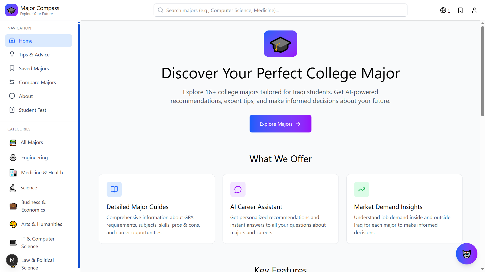

### Majors Page

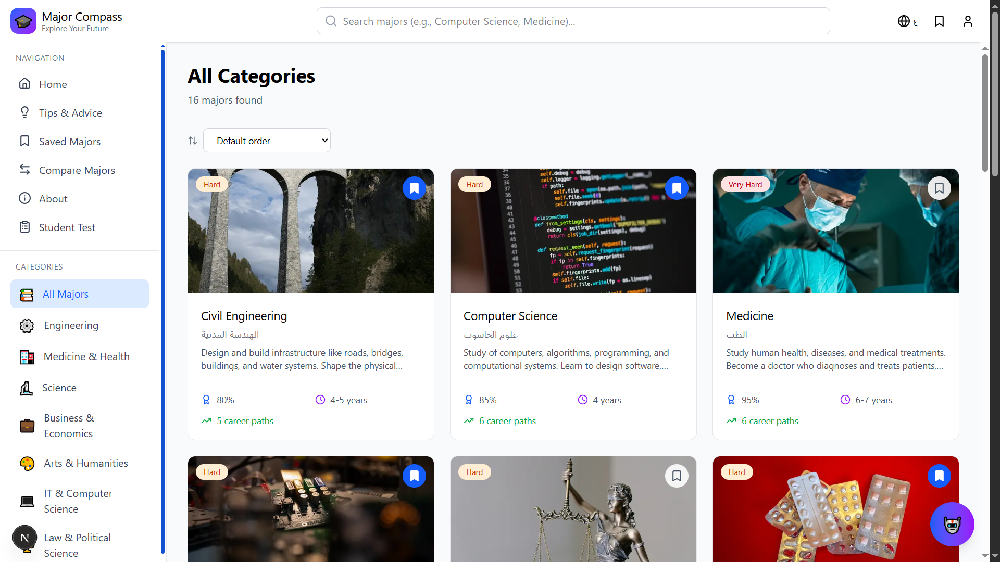

### AI Assessment Page

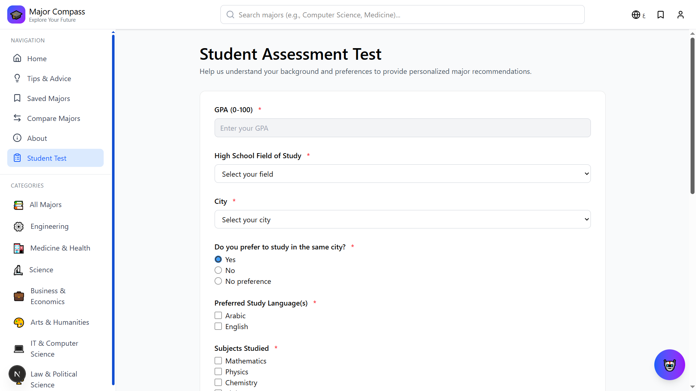

### Major Comparison Page

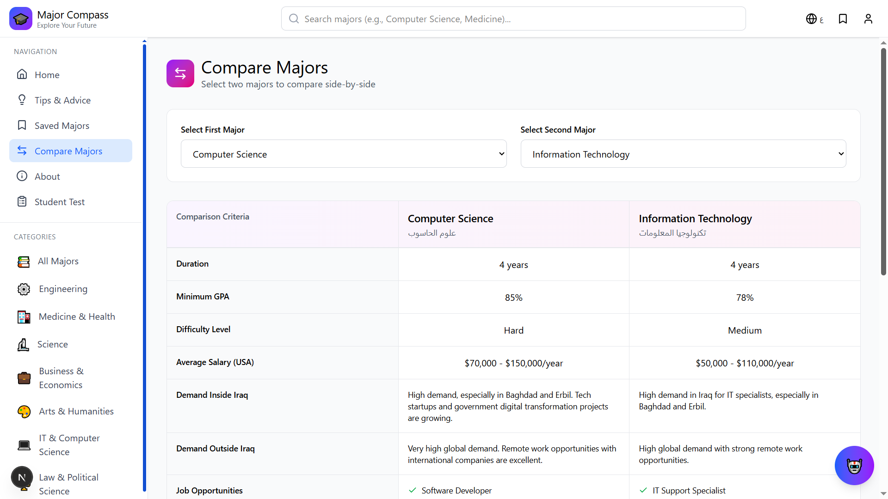

### About Page

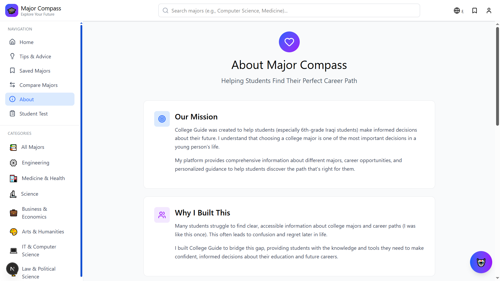

### Profile Page

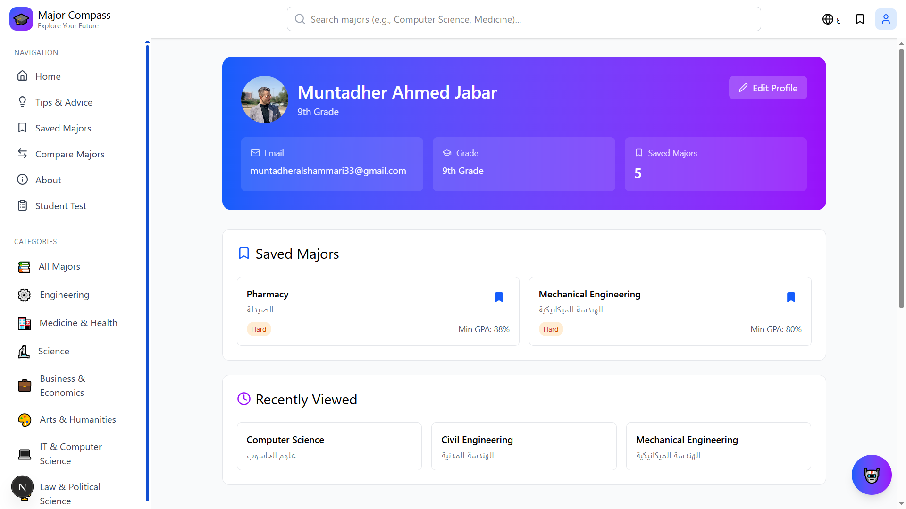

### Saved Majors Page

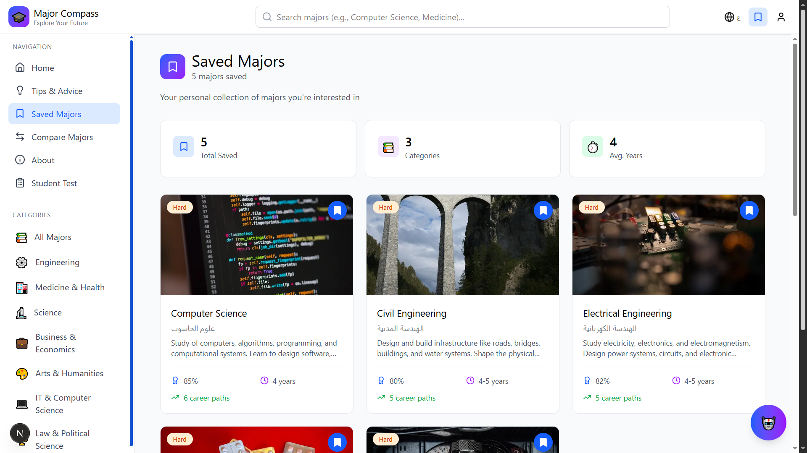

### Arabic Page Example

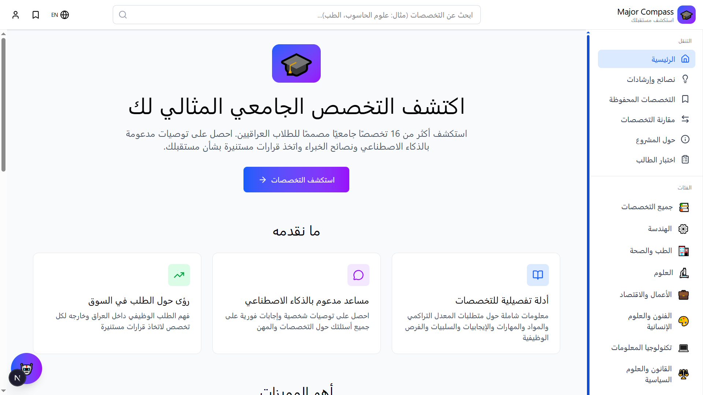

### Tips & Advice Page

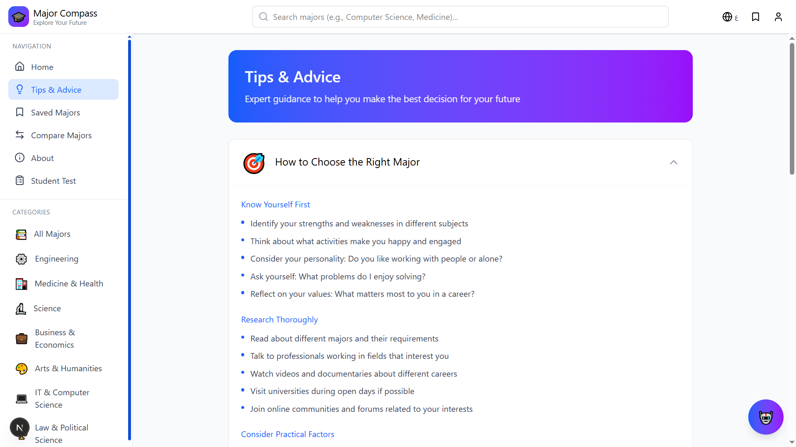

### Sign In Page

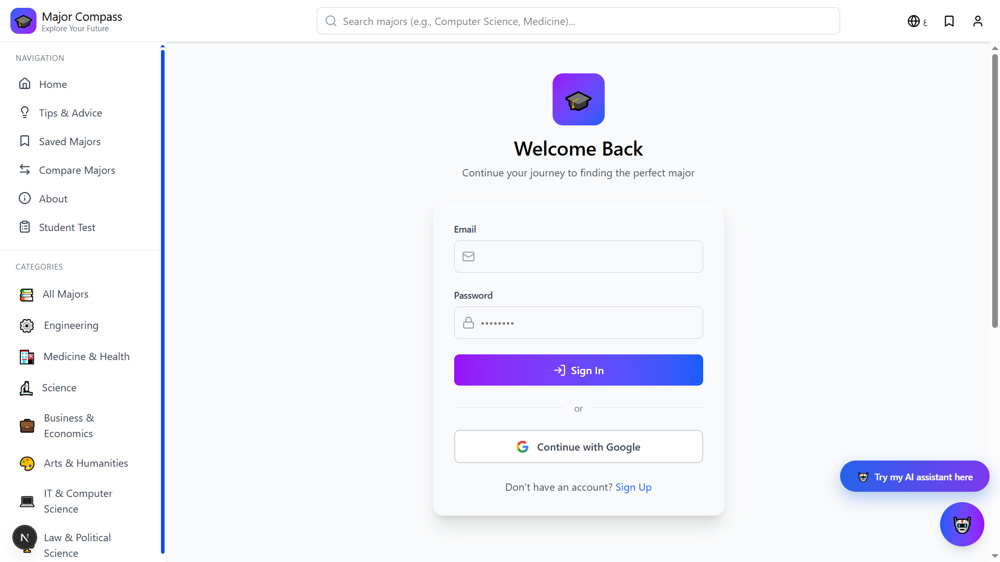

### Sign Up Page

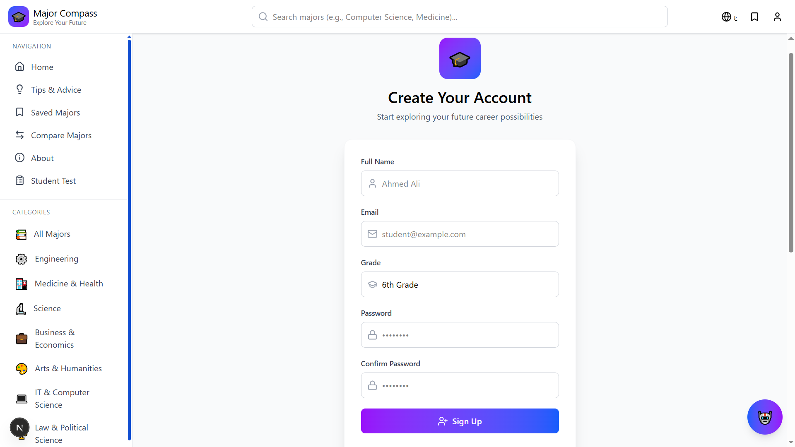

### AI Chatbot

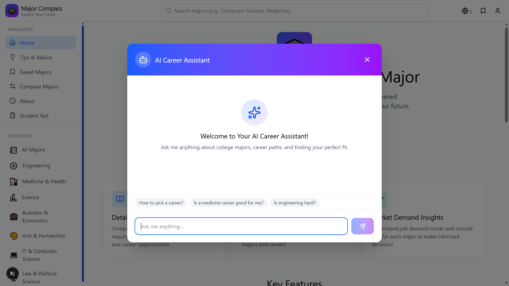

---

## How to Run Locally

### Prerequisites

- Node.js 18+ installed
- npm or yarn package manager

### Installation Steps

```bash
# 1. Clone the repository and navigate into it
git clone https://github.com/Eng-Muntadher/Major-Compass
cd Major-Compass

# 2. Install dependencies
npm install      # or yarn install / pnpm install

# 3. Start the development server
npm run dev      # or yarn dev / pnpm dev

# 4. Open the app in your browser
# Default URL: http://localhost:3000/
```

> Note: This repository provides the full frontend codebase. Some features (authentication, database, AI chatbot) will not work locally due to private credentials and production-only redirect URLs for the hosted app on Vercel.

---

### Environment Variables

Create a `.env.local` file in the root directory with the following variables:

```bash
NEXT_PUBLIC_SUPABASE_URL=your_supabase_url
NEXT_PUBLIC_SUPABASE_ANON_KEY=your_supabase_anon_key
OPENAI_API_KEY=your_openai_api_key
```

> Note: You'll need to set up your own Supabase project and OpenAI API account to use these features locally.

---

## 🤝 Contributing

Contributions are welcome! Please feel free to submit a Pull Request.

1. Fork the project
2. Create your feature branch (`git checkout -b feature/AmazingFeature`)
3. Commit your changes (`git commit -m 'Add some AmazingFeature'`)
4. Push to the branch (`git push origin feature/AmazingFeature`)
5. Open a Pull Request

---

## 👨‍💻 Author

Muntadher Ahmed

- GitHub: [@Eng-Muntadher](https://github.com/Eng-Muntadher)
- LinkedIn: [Muntadher Ahmed](https://www.linkedin.com/in/montadar-ahmed-4577b6333)
- Portfolio: [muntadher-ahmed.vercel.app](https://muntadher-ahmed.vercel.app)

---

## Why Major Compass?

Many students (especially where I'm from) choose their college majors without enough guidance, often relying on limited information or social pressure. I built Major Compass to bridge that gap by combining structured academic data with AI-powered guidance, helping students make more informed, confident decisions about their future.

---

## License

This project is licensed under the [MIT License](./LICENSE).
